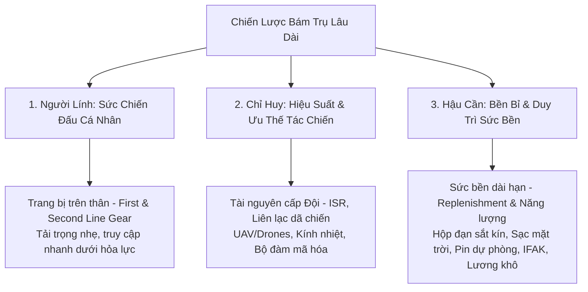

# CHIẾN LƯỢC PHÂN LOẠI KHÍ TÀI DÃ CHIẾN: "BÁM TRỤ LÂU DÀI TRÊN CHIẾN TRƯỜNG"
> **Hệ thống phân loại tối ưu hóa khả năng sinh tồn và hiệu suất tác chiến của đơn vị dựa trên góc nhìn thực tế của Chiến sĩ, Chỉ huy và Cán bộ Hậu cần.**

Hệ thống danh mục này được thiết kế đặc biệt cho ứng dụng Army+ nhằm phục vụ chiến sĩ tác chiến ngoài thực địa. Chúng tôi loại bỏ danh mục mang tính hình thức ("Vinh danh") để tập trung hoàn toàn vào **Khí tài trực chiến, Thiết bị công nghệ cao (Drones), Đạn dược, Năng lượng và Y tế** - những yếu tố cốt lõi quyết định sự sống còn và khả năng bám trụ dài ngày của đơn vị tại các trận địa biệt lập hoặc chốt chặn dã chiến.

---

## 1. Tư Duy Đa Chiều: Tích Hợp Ba Góc Nhìn Thực Chiến

Để chia danh mục một cách tối ưu và thuận tiện nhất cho người lính, chúng tôi đồng bộ hóa nhu cầu của ba lực lượng cốt lõi trên chiến trường:



### 1. Góc nhìn của NGƯỜI LÍNH (Sự sống còn & Phản ứng nhanh)
*   **Mối quan tâm**: Tải trọng cá nhân (bố trí trang bị First Line & Second Line trên người), tính sẵn sàng của vũ khí (súng sạch, không kẹt đạn), khả năng băng bó vết thương khẩn cấp (IFAK) và giữ ấm/chống ẩm cho cơ thể.
*   **Giải pháp phân loại**: Gom nhóm "Hỏa lực Tác chiến" trực quan, đưa các phụ kiện súng, đạn dược và bao xe đựng đạn vào một mục chung giúp lính bộ binh tính toán nhanh số lượng băng đạn mang theo.

### 2. Góc nhìn của CHỈ HUY (Ưu thế thông tin & Điều phối hỏa lực)
*   **Mối quan tâm**: Khả năng giám sát chiến trường (UAV/Drones, kính nhìn đêm), liên lạc thông suốt với sở chỉ huy và pháo binh (bộ đàm mã hóa), và phân bổ hỏa lực chống thiết giáp/bộ binh địch.
*   **Giải pháp phân loại**: Tách riêng danh mục "Trinh sát & Drones" và "Năng lượng & Liên lạc". Đây là các danh mục "Đơn vị cấp" (Squad-level assets) quyết định sự mù/điếc của cả tiểu đội trước đối phương.

### 3. Góc nhìn của CÁN BỘ HẬU CẦN (Duy trì sức bền & Bù đắp tiêu hao)
*   **Mối quan tâm**: Khả năng bảo quản đạn dược dài ngày chống sương muối/ẩm ướt (hộp đạn sắt kín khí), duy trì nguồn năng lượng sạc lại cho pin bộ đàm và UAV (tấm sạc mặt trời, pin dự phòng), bổ sung vật tư y tế khẩn cấp và dinh dưỡng dã chiến (lương khô chất lượng cao).
*   **Giải pháp phân loại**: Thiết kế danh mục "Năng lượng & Liên lạc", "Y tế & Cứu thương" và "Kỹ thuật & Bảo trì" rõ ràng. Hậu cần theo dõi lượng tiêu hao để kịp thời cấp phát bù đắp khi có tuyến tiếp vận dã chiến.

---

## 2. Hệ Thống Danh Mục Trực Chiến 6 Cấp Cốt Lõi

| Danh mục & Icon | Góc Nhìn Tác Chiến | Các Tiểu Mục Phân Loại (Sub-categories) | Sản Phẩm Điển Hình trong Army+ |
| :--- | :--- | :--- | :--- |
| 🛡️ **Hỏa lực Tác chiến**<br>*(Firepower & Combat)* | **Chiến sĩ & Chỉ huy**: Vũ khí chính, đạn dược chiến đấu và hệ thống mang đeo mang lại hỏa lực áp đảo trực tiếp. | • Súng trường & Súng ngắn chính quy<br>• Đạn dược & Hộp đạn dã chiến<br>• Băng đạn & Bao xe chiến thuật (Plate carrier) | • Súng trường Tấn công STV-380<br>• Hộp đạn sắt 7.62x39mm (700 viên)<br>• Bao xe mang đạn AK chống thấm |
| 🧭 **Trinh sát & Drones**<br>*(Recon, Drones & ISR)* | **Chỉ huy**: Force Multiplier - Mắt thần chiến trường phát hiện mục tiêu trước đối phương. | • Thiết bị UAV / Drones trinh sát dã chiến<br>• Kính ngắm nhiệt, Hồng ngoại & Nhìn đêm (NVG)<br>• Cánh quạt, Pin & Linh kiện thay thế UAV | • Drone trinh sát nhiệt Mavic 3 Thermal<br>• Pin dự phòng Mavic 3T (5000mAh)<br>• Kính nhìn đêm đơn mắt gắn mũ |
| ⚡ **Năng lượng & Liên lạc**<br>*(Power & Comms)* | **Hậu cần & Chỉ huy**: Xương sống duy trì công tác chỉ huy và hoạt động của tất cả thiết bị điện tử. | • Máy bộ đàm mã hóa & Tai nghe chống ồn<br>• Tấm sạc năng lượng mặt trời, Pin sạc đa năng<br>• Trạm nguồn dã chiến (Power Station) | • Bộ đàm kỹ thuật số mã hóa AES-256<br>• Tấm sạc năng lượng mặt trời 100W Cordura<br>• Pin sạc AA/CR123A dã chiến |
| 🎒 **Quân nhu & Sinh tồn**<br>*(Sustainment & Survival)* | **Chiến sĩ & Hậu cần**: Duy trì thể trạng khỏe mạnh, ấm áp và khô ráo của người lính dưới thời tiết mưa bùn hầm hào. | • Balo tác chiến, túi khô chống nước<br>• Tăng dù che mưa dã chiến, võng dù, túi ngủ<br>• Lương khô & Thực phẩm hành quân (MRE) | • Balo Tác chiến 3 Ngày (3Q ASECO)<br>• Hộp lương khô quân đội BB702<br>• Tấm tăng dù che mưa phủ bạc |
| ❤️ **Y tế & Cứu thương**<br>*(Trauma & Medical)* | **Hậu cần & Chiến sĩ**: Cứu chữa vết thương chiến tranh tức thì và duy trì vệ sinh ngăn ngừa dịch bệnh. | • Túi sơ cứu cá nhân khẩn cấp (IFAK)<br>• Trang bị quân y cấp tiểu đội (Cáng, nẹp)<br>• Viên lọc nước khẩn cấp, thuốc phòng dịch | • Túi sơ cứu cá nhân IFAK (TCCC)<br>• Garo cầm máu nhanh CAT Gen 7<br>• Viên lọc nước khẩn cấp Aquatabs |
| 🔧 **Kỹ thuật & Bảo trì**<br>*(Maintenance & Repair)* | **Chiến sĩ & Hậu cần**: Bảo đảm vũ khí không kẹt đạn, sửa chữa khẩn cấp các hư hỏng cơ khí nhỏ của trang bị tại chỗ. | • Bộ dụng cụ lau chùi súng bộ binh<br>• Dầu mỡ bảo dưỡng vũ khí chuyên dụng<br>• Kìm đa năng chiến thuật, xẻng bộ binh gấp gọn | • Bộ dụng cụ lau chùi súng bộ binh<br>• Kìm đa năng Leatherman Wave<br>• Xẻng bộ binh gấp gọn đa năng |

---

## 3. Các Giải Pháp UX Đặc Đặc Thù Cho Tác Chiến Dài Ngày (Battlefield UX)

Môi trường tác chiến dài ngày yêu cầu ứng dụng phải thiết kế giao diện cực kỳ tối giản, hỗ trợ thao tác nhanh bằng một tay hoặc trong điều kiện ánh sáng yếu:

```
+---------------------------------------------------------+
| [=] ARMY+ TACTICAL STORE                    [Giỏ hàng] |
+---------------------------------------------------------+
|  Tìm nhanh: "Đạn 7.62", "Pin UAV", "Garo CAT"...   [Q]  |
+---------------------------------------------------------+
|  DANH MỤC TRỰC CHIẾN                                    |
|                                                         |
|   🛡️ Hỏa lực     🧭 Drones       ⚡ Nguồn & C.Thông     |
|                                                         |
|   🎒 Quân nhu    ❤️ Y tế          🔧 Kỹ thuật            |
|                                                         |
+---------------------------------------------------------+
|  TRẠNG THÁI TIẾP VẬN TIỂU ĐỘI                          |
|  [!] Cảnh báo: Pin UAV chỉ còn 2 bộ - Đặt bù ngay [Mua] |
+---------------------------------------------------------+
|  TRANG BỊ THIẾT YẾU BÁM TRỤ (Sản phẩm nhanh)            |
|                                                         |
|  +--------------------+      +--------------------+     |
|  | [Ảnh STV-380]      |      | [Ảnh Hộp đạn sắt]  |     |
|  | Súng STV-380 (5.45)|      | Hộp Đạn Sắt (700v) |     |
|  | 15.000.000 Điểm    |      | 1.200.000 Điểm     |     |
|  | [THÊM NHANH]       |      | [THÊM NHANH]       |     |
|  +--------------------+      +--------------------+     |
+---------------------------------------------------------+
```

### Các tính năng thiết kế đột phá:
1. **Tiếp vận tự động cảnh báo (Tactical Auto-replenishment)**: Tích hợp cảnh báo từ Chỉ Huy hoặc hệ thống hậu cần trung tâm. Khi lượng đạn tiêu thụ hoặc pin dự phòng của tiểu đội giảm xuống dưới mức an toàn (red zone), ứng dụng sẽ hiện nút nổi bật gợi ý đặt bù súng đạn hoặc vật dụng sửa chữa ngay trên Trang chủ.
2. **Offline-First Transaction**: Cho phép chiến sĩ chọn đồ trong giỏ hàng và gửi yêu cầu cấp phát thông qua mạng truyền tin vô tuyến nội bộ (mạng bộ đàm số dã chiến) mà không cần mạng internet viễn thông thương mại GSM/4G. Hệ thống lưu trữ SQLite nội bộ sẽ xếp hàng đợi (Sync Queue) và đồng bộ ngay khi lọt vào vùng phủ sóng.
3. **Thanh toán Hậu cần Ủy quyền (Logistics Authorization)**: Cho phép Chiến sĩ gửi trực tiếp giỏ hàng cho Cán bộ Hậu cần hoặc Chỉ huy Đại đội duyệt mua bằng "Quỹ Quân nhu Đơn vị" thay vì tự chi trả bằng điểm tích lũy cá nhân, bảo đảm việc phân phối khí tài dã chiến nhanh nhất đến tay người cầm súng.
